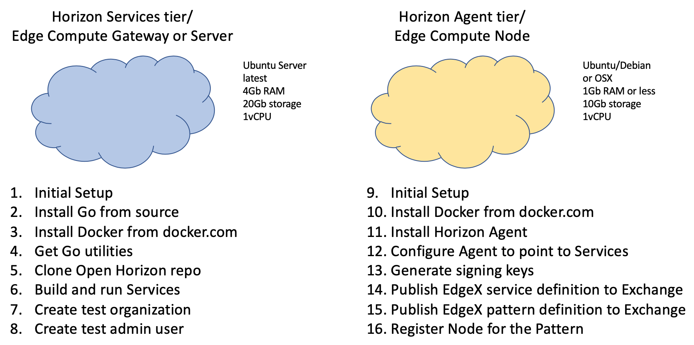

# Delivering EdgeX Foundry with Open Horizon

Caveat Emptor: This document will give you the steps needed to get a small dev instance of the Horizon services running. 
It will not, and should not, be used to serve edge devices in a production environment. 
However, it is sufficient to test services.

## Goals

In this POC you will be setting up Horizon Services in one tier (Exchange, Switchboard, AgBots), 
and then the Horizon Agent (Anax) in another tier.  
You will be configuring an organization and an admin-enabled user account (into that organization) on the Horizon Exchange, 
and then using the Horizon Agent to register the EdgeX micro-services as a single Service and a Pattern. 
You will finally register the device that is running the Agent as an edge Node with the Exchange, 
which will trigger the Pattern to be downloaded by the Node, 
which will in turn stand up the micro-services, monitor them, and keep them running.
Registering EdgeX Foundry as an Open Horizon Pattern

## High Level Steps

+ [Horizon Dev Services Setup](01-horizon-services-setup.md)
+ [Build and Run](02-build-and-run-horizon.md) the Horizon Dev Services
+ [Install the Anax Agent](03-install-agent.md) software
+ [Configure the Agent](04-configure-anax.md)

## FAQ

TBD